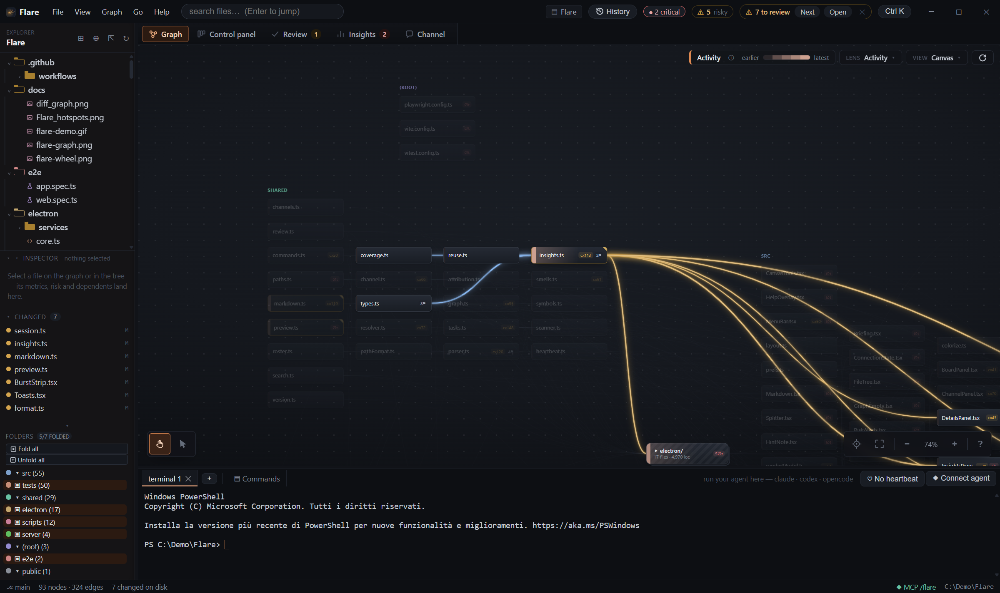
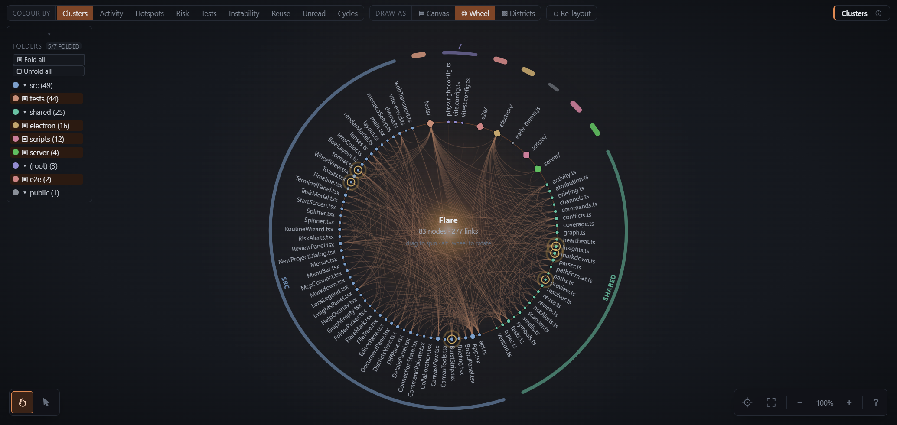

# Flare

**A graph-first IDE for agentic coding — desktop app, or served to a browser
from the machine the agent runs on.**

The main surface is a live graph of your codebase — every file is a node,
imports are edges — with a full terminal underneath where you run `claude`,
`codex` or `opencode`. As the agent edits files, the graph updates in real
time; every change burst is snapshotted into a local shadow history you can
diff against and revert to, per file or as a whole tree.

<br clear="left" />


## What you get



*Flare open on its own source. The Activity lens highlights the seven files an
agent just edited, and hovering `shared/types.ts` highlights every file that
imports it — the blast radius of one file, without reconstructing it from a
grep.*

### Three views of the same graph

Switchable from the toolbar or the command palette. Each honours the active
lens, the selection, collapsed directories and the search filter.

- **Canvas** (default) — dependency cards on a pannable board, ordered
  left-to-right by dependency depth (SCC-condensed, crossing-reduced, wrapped
  into bands so a long chain never becomes an unreadable strip): foundations
  left, entry points right. Cards carry the filename, a lens-coloured rail and
  badges (complexity, coverage %, untested, TODOs, cycles). Hovering traces
  imports in blue and importers in amber; shift+click traces the path between
  two files; cards can be dragged and their positions persist. Zooming out
  swaps the cards to a plate skin (semantic zoom) so the shape of the repo
  still reads.
- **Wheel** — every node sits on one ring ordered by directory, dependencies
  cross the middle as bundled chords, and cluster bands are labelled around the
  outside. Drag to spin, alt+wheel to rotate, scroll to zoom, shift+drag to
  pan, ctrl+drag to box-select. Click a node to *pin* its dependency
  directions; hover a cluster band to isolate that directory; click a band to
  collapse or expand it.
- **Districts** — a squarified treemap where area is lines of code and shade
  is the active lens. The fastest read on "how big is this repo and where
  does the mass sit"; selecting a file outlines everything it touches.



*The Wheel answers the one question the canvas cannot: what talks to what
across the whole repo at once. A file whose chords fan across the entire disc
is load-bearing whether or not anyone documented it that way. Node dots take
the active lens, cluster bands are coloured by directory.*

### Features

- **Folders that open one level at a time** — a folder card holding more files
  than fits on a screen unfolds into its *sub-folders*, not into four hundred
  cards. A `src/` that is 90% of the repo therefore has a middle state: it opens
  into `src/app`, `src/features`, `src/libs`… with the dependencies between them
  drawn, and each of those opens again. Folding it back remembers how far you
  had drilled.
- **Lenses** — recolour the same layout by Clusters, Activity, Hotspots
  (churn × complexity), Risk, Tests, Coverage, Instability, Reuse, Unread or
  Cycles. Whichever is active, a strip under the toolbar explains how to read
  the colours and shows the matching scale.
- **Everything is discoverable** — a VS Code-style File / View / Graph / Go /
  Help menu bar, a `?` cheat sheet listing every click, drag and shortcut for
  the current view, and a tooltip on every control saying what it does rather
  than what it is called. What acts on the *view* — pointer mode bottom-left;
  centre, fit, zoom and the cheat sheet bottom-right — sits on the canvas
  corners rather than in a toolbar strip above it.
- **Task board** — a kanban of work written to be *handed to an agent*. A card's
  primary action is **Copy for agent**: it emits the brief plus the files it
  names plus what the graph knows about them ("29 files downstream, 0%
  covered, in an import cycle"), so the agent starts from the map instead of
  spending half its context rediscovering it. File a card straight from a graph
  selection with right-click → *New task with these files*. Lanes are yours —
  add, rename, reorder or remove them; removing one rehomes its tasks rather
  than dropping them.

  The same lanes are queryable over MCP, so an agent can run its own loop:
  `tasks_list` (optionally by lane) to pick up work, `task_get` for the exact
  brief a human would have pasted, `task_update` to log progress and move the
  card to review, and `task_create` to file follow-up work it finds but
  shouldn't do now. Moves show up on the board live.
- **Review cockpit** — the tab that answers the questions a file-by-file diff
  can't. Changes are grouped into *bursts* (one batch of writes by one author),
  and each burst shows:
  - **what actually checked it.** The IDE sees both the file writes and the
    commands run in its terminals, so it can say *"the tests ran, then two more
    files were edited and nothing re-ran"* — the states are verified / failed /
    **checked, then edited again** / never checked, always quoting the output
    line the verdict came from.
  - **what it was trying to do.** Agents call the `record_intent` MCP tool
    before editing; otherwise the burst says so plainly, because reviewing an
    agent's diff makes you the first human to see that code with nothing
    explaining why it exists.
  - **which files deserve attention.** Every file is tiered *read carefully /
    read / skim* from blast radius, coverage, cycles and complexity, with the
    reason spelled out ("9 files break if this is wrong", "no test covers it"),
    so a 30-file change doesn't get 30 equal glances.
  - **agent smells.** Rules for the shortcuts agent changes take and human ones
    don't: a test edited in the same burst as the code it covers, assertions
    deleted, `.skip`/`.only` added, lint or type suppressions introduced,
    coverage thresholds lowered, complexity spikes, files left with no
    importers, abstractions extracted for a single caller.
  - **one-click undo.** Every burst has a snapshot: revert a file, revert the
    burst, or jump **back to the last state whose checks passed**.
  - **walkthrough** — step the graph through a burst's files worst-risk first,
    approving as you go.
- **Risky changes come and find you** — the review tab is a tab, so a load-
  bearing file rewritten while you were reading the graph goes unnoticed until
  you go and look. Those changes queue as alerts in the corner instead, one
  card per file, newest first, staying put until answered: **Review** opens the
  change on its row in the review panel, **Dismiss** stops that card, **Dismiss
  all** clears the queue. Dismissing an alert is not approving the change — the
  file stays flagged, unread and exactly as the agent left it. The bar is the
  *careful* tier plus something absolute (real dependents, a cycle, real
  complexity, no test at all), so a repo where nothing is load-bearing stays
  quiet rather than popping a card for its least boring file.
- **Comprehension debt, measured** — the *Unread* lens paints every file that
  changed this session and no human has opened since; approving does not clear
  it, opening the file does. Insights shows the repo-level percentage.
- **Every command classified** — the command log labels each observed command
  read / writes / verify / network / **destructive**, filterable, with the
  pass/fail verdict next to verification runs. Destructive commands
  (`rm -rf`, `git reset --hard`, `push --force`, `npm publish`, …) raise an
  alert and trigger a snapshot.
- **Coverage ingestion** — drop an `lcov.info` (vitest/jest `--coverage`, nyc,
  pytest-cov…) in `coverage/` or the project root and it's picked up live: a
  Coverage lens appears, per-file percentages land in the details panel and
  hover cards, and real coverage replaces the test-linkage heuristic inside
  the review-risk score.
- **Drill-downs** — collapse any directory into an aggregate meta-node (click
  its legend chip or double-click the node); expand any file into its
  functions/classes with symbol-level edges. Shift-click two nodes to highlight
  the import path between them.
- **Cross-agent tracking** — the process tree of every terminal is watched for
  claude / codex / opencode / aider / …; changes made while an agent runs are
  attributed to it (coloured node rings, trails on the graph, "changed by" in
  details), and every shell command run in the terminals lands in the
  **Commands log** (▤ button in the terminal bar, persisted per project).
- **Command palette** — Ctrl+K: fuzzy-jump to any file, `>` for commands,
  recent projects. Ctrl+B sidebar, Ctrl+W close tab, Ctrl+0 fit graph,
  Ctrl+=/− zoom, Esc collapses focus/drill-down. Full list under
  `> keyboard shortcuts`.
- **Insights** — a unified metrics + issues view: per-file risk/hotspot/
  refactor composites, blast radius, churn (git + session), coverage, TODOs,
  co-change coupling; severity-ranked rules (regression-risk, god-file,
  agent-thrash, coverage-gap, cycles, dead code…) with a critical-alert badge
  and toasts.
- **Reuse** — how cleanly each file would come out if you lifted it into a
  package, 0–100, plus one number for the whole repo. It counts the four
  things that actually stop you: talking to the host (`fs`, sockets, a
  database), being bound to a framework, dragging a large share of the repo
  along, and sitting in an import cycle. Being widely imported is *not* a
  penalty — a util forty files depend on is the most reusable thing you have,
  which is the opposite of how risk reads the same number. Unlike the other
  composites it is an absolute scale rather than a ranking within the repo: if
  everything imports `fs`, the least-bad file has not become reusable. The
  `mixed-concerns` rule points at the files where logic is trapped behind the
  plumbing and worth separating.
- **MCP server for your agents** — one shared, localhost-only endpoint for
  the whole machine, however many Flare windows are open. Each instance
  runs a private ephemeral server and registers in a per-pid file registry;
  whichever instance holds the well-known port (default 7345,
  `FLARE_MCP_PORT`) acts as the gateway and routes `…/mcp/<slug>` — the same
  stable per-project slug the browser server uses — to the owning instance,
  proxying when needed and taking over the port when the holder exits. Bare
  `/mcp` works with a single session; with several it points the agent at
  `list_projects`. Click the ⚡ MCP status-bar item to copy the project-scoped
  setup command:

  ```sh
  claude mcp add --transport http flare http://127.0.0.1:7345/mcp/<slug>
  ```

  Tools: `graph_overview`, `file_info`, `dependents`, `dependencies`,
  `find_path`, `issues`, `top_files`, `search`, `impact_of` (what breaks +
  which tests to run before changing files), `recent_activity`,
  `verification_status` (did my changes actually get checked?),
  `record_intent` (state the goal before editing, so the human reviewing the
  diff isn't reconstructing it) and the board tools — `tasks_list`, `task_get`,
  `task_update`, `task_create`. The agent asks the IDE about the codebase
  instead of re-deriving it.
- **Workspace restore** — tabs, lens, active view, panel sizes, collapse
  state, node positions and window bounds all persist per project.
- **Live change tracking** — a debounced watcher re-parses changed files and
  patches the graph in place. Changed-but-unreviewed nodes are marked in
  warning-orange with a heat decay, so an agent's progress is visible as it
  works.
- **Review queue** — every file changed since your last checkpoint is flagged.
  Nothing is gated: an agent writes straight to disk, so reviewing is deciding
  what to keep. Dismiss clears the marker and changes nothing; revert puts the
  files back. Review next walks them worst-risk first, and each node shows its
  blast radius (transitive dependents), import counts and symbols.
- **Shadow history ("git of local changes")** — a hidden git repo (separate
  `GIT_DIR`, your worktree) auto-commits every change burst. Timeline panel lists
  snapshots; diff any file against any snapshot, revert one file or restore the
  whole tree. Your real repo is never touched.
- **Git integration** — branch + per-file status in the tree and graph, diff vs
  HEAD in a Monaco diff editor.
- **IDE basics** — file tree, Monaco editor (VS Code's editor) with Ctrl+S save
  and external-change reload, multiple terminals (xterm.js + node-pty) running
  real shells.

## Testing

```sh
npm test          # 350 vitest unit tests (parser, resolver, graph, scanner, git, shadow, store, reuse)
npm run e2e       # 73 Playwright tests: 49 driving the real Electron app, 24 driving a browser
npm run verify    # build + unit + e2e
```

## Architecture

**One implementation, two transports.** `electron/core.ts` is all of Flare's
behaviour with no window and no Electron: a map of channels to handlers, and an
`onEvent` callback. The desktop main process and the browser server are
adapters that only translate — neither names a channel, so a feature added to
the core reaches both without a second edit. `tests/singleSource.test.ts`
enforces that, and it is why serving Flare to a browser did not fork the
codebase.

- `shared/` — pure engine: import parser (comment/string-safe lexer + regex),
  module resolver, incremental graph builder with patch diffing, project scanner.
  No Electron dependencies; fully unit-tested.
- `electron/core.ts` — the backend: project session (scan → graph → watcher →
  events), git service, shadow-history service, PTY service, agent monitor, MCP
  server, persisted per-project store (node positions, review state). Plain
  Node. The desktop-only bits — folder picker, OS clipboard, window buttons —
  are injected as an optional `CoreHost`.
- `electron/main.ts` + `preload.ts` — the desktop adapter: a window, its
  remembered bounds, the macOS menu, and a generic `contextBridge` bridge.
- `server/` — the browser adapter: serves the built `dist/` and carries the
  same calls and events over one websocket, riding on the ports the MCP server
  already owns so one instance needs exactly one port. A supervisor holds the
  port and serves the start screen; each project it is asked for becomes a
  session process of its own at `/<slug>/`. Everything it serves, websocket
  included, is behind the token in `server/auth.ts`.
- `src/api.ts` — the typed client both transports share; the only line that
  differs between desktop and browser is which transport it is handed.
- `src/` — React renderer: the three graph views (`CanvasView`, `WheelView`,
  `DistrictsView`) over a shared render model and lens palette, Monaco
  editor/diff, xterm terminals, file tree, details panel, timeline, review
  banner.

Node ↔ renderer flow: chokidar batch → re-parse → graph diff → `evt:graphPatch`
→ graph patch + heat, plus debounced git status refresh and shadow snapshot.

## Run it

Requires Node 20 or newer.

```sh
npm install
npm run build     # bundle main process (esbuild) + renderer (vite)
npm start         # launch the desktop app
```

## Install it (Windows / macOS / Linux)

```sh
npm run dist      # build a platform installer into release/
```

Produces an NSIS installer on Windows, dmg/zip on macOS, AppImage/deb on Linux
(run on the target platform — electron-builder doesn't cross-compile native
deps). `npm run dist:dir` makes an unpacked build for quick testing. The title
bar is platform-aware: custom controls on Windows/Linux, native inset traffic
lights on macOS.

Development mode (hot reload for the renderer):

```sh
npm run dev
```

Flare opens to a start screen listing your recent projects — arrow keys and
Enter, or `Ctrl+O` to pick a new folder. The last project you had open is the
first row, so restoring it is one keystroke rather than an assumption.
`FLARE_PROJECT=<path>` skips the start screen and opens that project directly.

## Run it in a browser (any remote machine)

Flare's review cockpit works by watching the process tree under its own
terminals, so the backend has to run on the machine the agent runs on. When
that is not your laptop — a VM, a dev container, a build box, a cloud
workstation, anything you reach over SSH or a forwarded port — serve it
instead of installing it:

```sh
npm install
npm run serve                          # or `npm run serve -- /path/to/project`
```

```
Flare — http://127.0.0.1:7345/?token=oq_F45fBJGdMTK4NJdm6y53n7-lHezBd
  the token is asked for once per browser — ~/.flare/web-token
  open it to pick a project — each one gets its own url
```

**The port is the start screen.** Open it and you get Flare's own start
screen — the same one the desktop app opens to: the projects you have opened
before, and a folder browser that walks the filesystem on that machine. Pick
one and it starts a session for it and takes you to its URL:

```
http://127.0.0.1:7345/api/
```

From there it is the same IDE: the graph, the editor, the review cockpit, and a
real terminal on the remote machine.

**One port, many projects.** The url is the folder name — `/api/`, not
`/api-3f21b8/`. It is assigned once and remembered, so it stays the same across
restarts and reboots; two projects sharing a folder name get qualified by their
parent (`/side-api/`) rather than by a hash. Each project runs as its own
process with its own terminals and its own agents, so several can stay open in
several tabs without touching each other. Whichever process holds the port
routes to the others; when it exits another takes over and every URL keeps
working. Agents connect over that same port at `/mcp/<slug>`, so a restricted
machine only ever has to expose one.

**Getting to the port.** Flare listens on `127.0.0.1` by default and tells you
so — a loopback URL is useless from the laptop you are actually sitting at, so
it prints the machine's real addresses too and says what to do about them:

```
Flare — http://127.0.0.1:7345/?token=oq_F45fBJGdMTK4NJdm6y53n7-lHezBd
  reachable from this machine only. From your laptop, either
    ssh -L 7345:127.0.0.1:7345 you@workbench
    or restart with --host 0.0.0.0 for http://10.128.0.7:7345/?token=…
```

A tunnel or your cloud IDE's port forwarding exposes nothing and works
anywhere. Flare's asset and websocket URLs are page-relative, so it also runs
unmodified behind a path prefix — `jupyter-server-proxy`'s `/proxy/7345/`, a
VS Code tunnel, an nginx `location` block — with no configuration.

**The token.** Behind this port are your files, your history and a live shell,
so the browser side asks for a token — the one in the URL above. It is
generated on first run and kept in `~/.flare/web-token`, so the printed URL
keeps working across restarts; `--token <value>` or `$FLARE_TOKEN` sets your
own. Opening a URL that carries it stores a cookie, so it is asked for once per
browser and never appears in an address bar again; a URL without one gets a box
to paste it into. Scripts can send it as `Authorization: Bearer` or
`X-Flare-Token`. `--no-token` (or `$FLARE_NO_TOKEN=1`) turns the whole thing
off, for a tunnel you trust or a proxy that already authenticates.

Agents are outside it: `/mcp/<slug>` stays open, because a token there would
break every `claude mcp add` line already written into a config file. It is
loopback-only unless you widen the host.

**`--host 0.0.0.0` (or `$FLARE_HOST`) listens on every interface** and prints
the URLs that will answer, hostname first. Do this only on a network you trust:
the token is the only thing in front of a filesystem and a shell, and the MCP
endpoint moves with it. The per-instance private ports stay on loopback either
way; only the shared one moves.

**The URL of the machine, whatever shape it takes.** Every hosted environment
addresses a forwarded port differently, and none of those addresses appear in
the VM's own interfaces — so Flare derives the shape from the environment
rather than assuming one:

| where it runs | the URL it prints |
|---|---|
| your PC, a bare VM | its hostname and real addresses |
| GitHub Codespaces | `https://<codespace>-7345.app.github.dev/` |
| Gitpod | `https://7345-<workspace>.gitpod.io/` |
| JupyterHub, `jupyter-server-proxy` | `https://<hub>/user/<you>/proxy/7345/` |

Project slugs are appended to whichever it found, so the printed URL is the
one you can actually paste:

```
Flare — https://hub.example.com/user/malte/proxy/7345/
  api → https://hub.example.com/user/malte/proxy/7345/api/
```

Anything else behind a proxy Flare cannot see takes `--public-url` (or
`$FLARE_PUBLIC_URL`, which sessions inherit). A bare host gets the port
appended; a value that already carries a port, a path prefix, or `https` is
used exactly as given.

State lives in `~/.flare` (`$FLARE_USERDATA` to move it), the token included;
`--port` or `$FLARE_PORT` changes the shared port.

The terminal's PTY module is the only native dependency; everything else is
pure JS, so on an unfamiliar machine that is the one thing worth checking:

```sh
node -e "require('@lydell/node-pty')"   # silence means the terminal will work
```

This is not a second app: it is the same `dist/` bundle and the same backend as
the desktop build, reached over a websocket instead of Electron IPC — see
[Architecture](#architecture).

## License

MIT — see [LICENSE](LICENSE).
